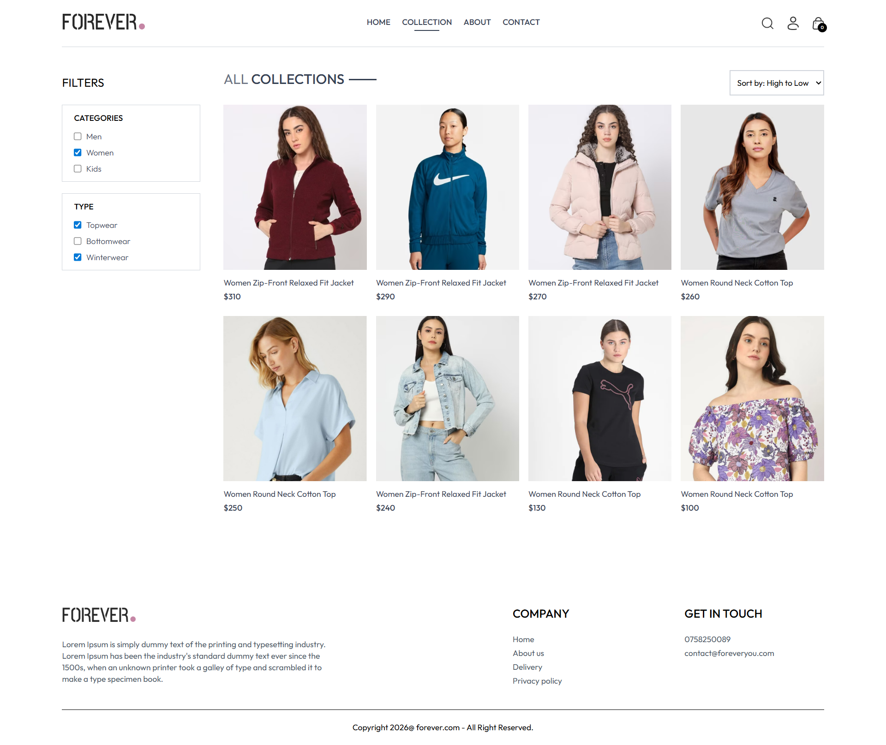
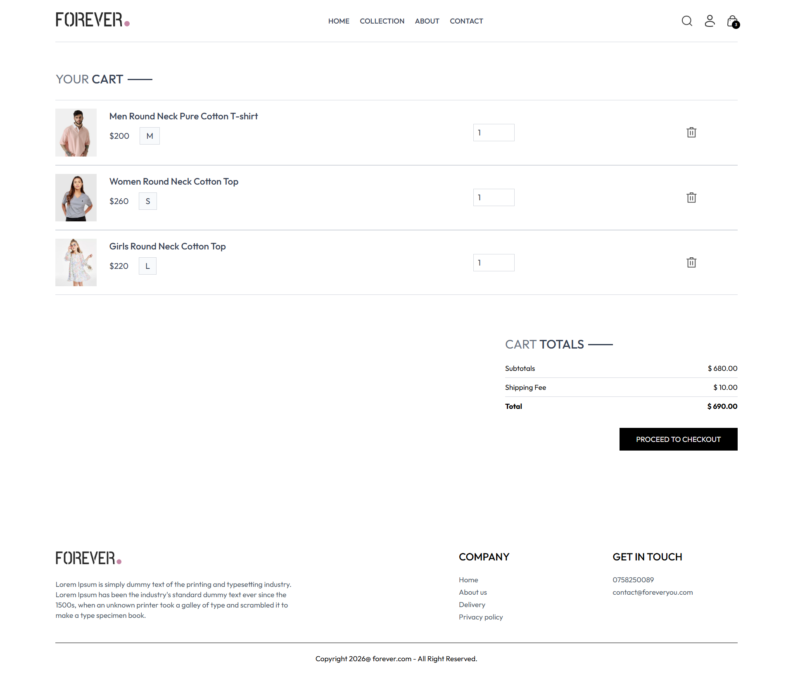
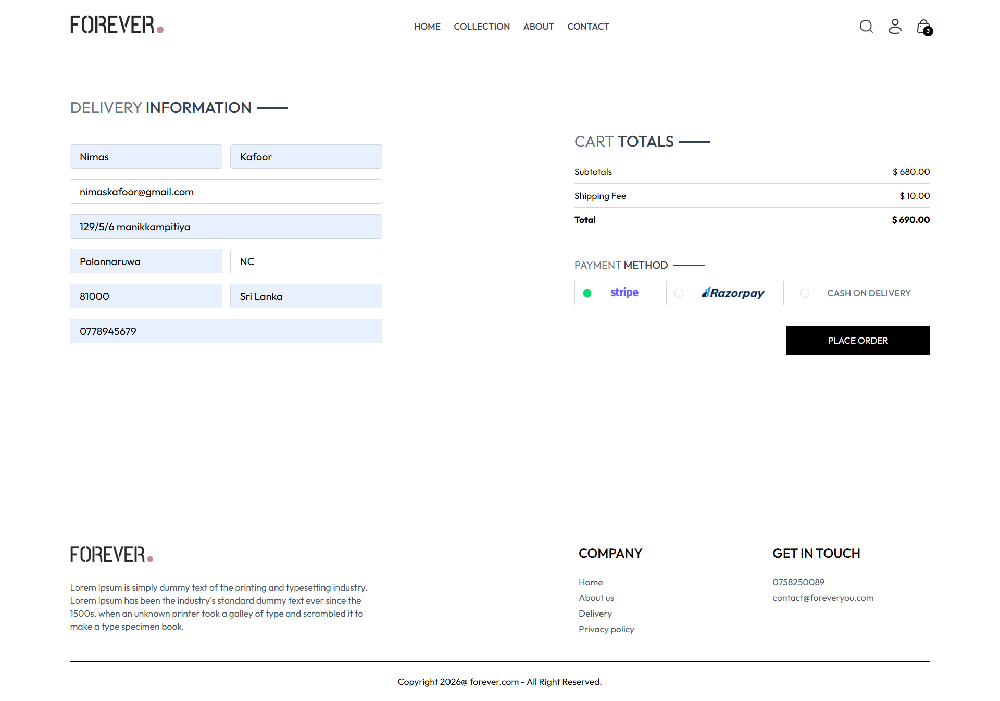
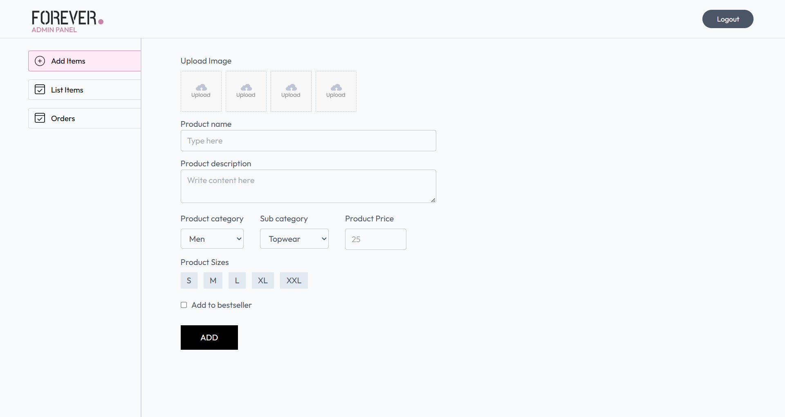

# 🛒 Full-Stack E-Commerce Web Application

A production-ready full-stack e-commerce platform built with the **MERN Stack** (MongoDB, Express.js, React.js, Node.js) featuring secure payments via **Stripe**, complete product management, user authentication, and order tracking — with a dedicated **Admin Panel**.

---

## 🌐 Live Demo

| Panel | URL |
|-------|-----|
| Frontend | `https://ecommerce-frontend-topaz-kappa.vercel.app` |
| Admin Panel | `https://ecommerce-app-admin-self-omega.vercel.app` |
| Backend API | `https://ecommerce-app-backend-psi.vercel.app` |

---

## ✨ Features

### 🧑‍💻 Frontend (Customer)
- User Registration & Login (JWT Authentication)
- Browse & Search Products
- Filter by Category & Price
- Product Detail Page
- Add to Cart 
- Place Orders (COD & Stripe)
- Order History & Tracking
- Responsive Design (Mobile Friendly)

### 🛠️ Admin Panel
- Secure Admin Login
- Add / Delete Products
- Upload Product Images (Cloudinary)
- Manage All Orders
- Update Order Status
- Dashboard Overview

### ⚙️ Backend (API)
- RESTful API with Express.js
- JWT Authentication & Authorization
- Stripe Payment Integration
- Image Upload via Cloudinary
- MongoDB Database with Mongoose

---

## 🧰 Tech Stack

| Layer | Technology |
|-------|-----------|
| Frontend | React.js, Tailwind CSS, Axios |
| Backend | Node.js, Express.js |
| Database | MongoDB, Mongoose |
| Authentication | JSON Web Tokens (JWT) |
| Payment | Stripe |
| Image Storage | Cloudinary |
| State Management | React Context API |

---

## 📁 Project Structure

```
ecommerce-app/
│
├── frontend/               # React.js Customer App
│   ├── src/
│   │   ├── components/     # Reusable Components
│   │   ├── pages/          # Page Components
│   │   ├── context/        # React Context (State Management)
│   │   └── assets/         # Images & Static Files
│   └── package.json
│
├── admin/                  # React.js Admin Panel
│   ├── src/
│   │   ├── components/     # Admin Components
│   │   ├── pages/          # Admin Pages
│   │   └── assets/
│   └── package.json
│
├── backend/                # Node.js + Express API
│   ├── controllers/        # Route Controllers
│   ├── models/             # Mongoose Models
│   ├── routes/             # API Routes
│   ├── middleware/         # Auth Middleware
│   ├── config/             # DB & Cloudinary Config
│   └── server.js
│
└── README.md
```

---

## 🚀 Getting Started

### Prerequisites

Make sure you have the following installed:
- [Node.js](https://nodejs.org/) (v18+)
- [MongoDB](https://www.mongodb.com/) or MongoDB Atlas account
- [Git](https://git-scm.com/)

---

### 1️⃣ Clone the Repository

```bash
git clone https://github.com/Kafoor-Nimas/ecommerce-app.git
cd ecommerce-app
```

---

### 2️⃣ Backend Setup

```bash
cd backend
npm install
```

Create a `.env` file in the `backend/` folder:

```env
MONGODB_URI=your_mongodb_connection_string
JWT_SECRET=your_jwt_secret_key
CLOUDINARY_NAME=your_cloudinary_cloud_name
CLOUDINARY_API_KEY=your_cloudinary_api_key
CLOUDINARY_SECRET_KEY=your_cloudinary_api_secret
STRIPE_SECRET_KEY=your_stripe_secret_key
ADMIN_EMAIL=admin@example.com
ADMIN_PASSWORD=your_admin_password
```

Start the backend server:

```bash
npm run server
```

Backend runs on: `http://localhost:4000`

---

### 3️⃣ Frontend Setup

```bash
cd frontend
npm install
```

Create a `.env` file in the `frontend/` folder:

```env
VITE_BACKEND_URL=http://localhost:4000
```

Start the frontend:

```bash
npm run dev
```

Frontend runs on: `http://localhost:5173`

---

### 4️⃣ Admin Panel Setup

```bash
cd admin
npm install
```

Create a `.env` file in the `admin/` folder:

```env
VITE_BACKEND_URL=http://localhost:4000
```

Start the admin panel:

```bash
npm run dev
```

Admin panel runs on: `http://localhost:5174`

---

## 💳 Payment Integration

This project uses **Stripe** for online payments.

- Use Stripe **test mode** for development
- Test card number: `4242 4242 4242 4242`
- Any future expiry date and any 3-digit CVC

---

<!-- ## 📸 Screenshots

> Add your screenshots here

| Page | Screenshot |
|------|-----------|
| Home Page |  |
| Product Page |  |
| Cart Page |  |
| Checkout Page |  |
| Admin Dashboard |  |

--- -->
## 📸 Screenshots

### 🛍️ Home Page


### 👗 Collection Page


### 📦 Product Page


### 🛒 Cart Page


### 💳 Checkout Page


### 🛠️ Admin Panel


## 🔗 API Endpoints

### Auth
| Method | Endpoint | Description |
|--------|----------|-------------|
| POST | `/api/user/register` | Register new user |
| POST | `/api/user/login` | Login user |
| POST | `/api/user/admin` | Admin login |

### Products
| Method | Endpoint | Description |
|--------|----------|-------------|
| GET | `/api/product/list` | Get all products |
| GET | `/api/product/single` | Get single product |
| POST | `/api/product/add` | Add product (Admin) |
| DELETE | `/api/product/remove` | Delete product (Admin) |

### Orders
| Method | Endpoint | Description |
|--------|----------|-------------|
| POST | `/api/order/place` | Place COD order |
| POST | `/api/order/stripe` | Place Stripe order |
| POST | `/api/order/userorders` | Get user orders |
| GET | `/api/order/list` | Get all orders (Admin) |
| POST | `/api/order/status` | Update order status (Admin) |

### Cart
| Method | Endpoint | Description |
|--------|----------|-------------|
| POST | `/api/cart/add` | Add to cart |
| POST | `/api/cart/update` | Update cart |
| POST | `/api/cart/get` | Get cart data |

---

## 🛡️ Environment Variables

> ⚠️ **Never commit your `.env` file to GitHub!**

Make sure `backend/.env` is listed in your `.gitignore`:

```
backend/.env
frontend/.env
admin/.env
```

---

## 🤝 Contributing

Contributions are welcome! Please feel free to submit a Pull Request.

1. Fork the project
2. Create your feature branch (`git checkout -b feature/AmazingFeature`)
3. Commit your changes (`git commit -m 'Add some AmazingFeature'`)
4. Push to the branch (`git push origin feature/AmazingFeature`)
5. Open a Pull Request

---


## 👨‍💻 Author

**Nimas Kafoor**
- GitHub: [@Nimas](https://github.com/Kafoor-Nimas)
- LinkedIn: [Nimas-Kafoor](https://www.linkedin.com/in/nimas-kafoor)

---

⭐ **If you found this project helpful, please give it a star!** ⭐